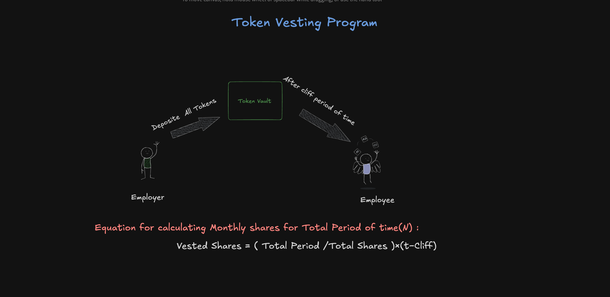
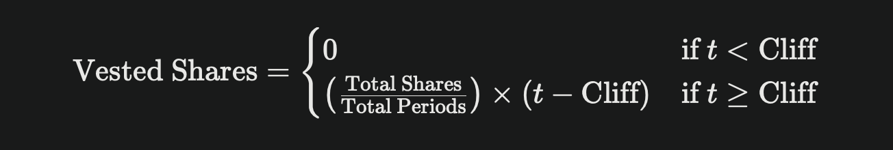

# Token Vesting Program

## What is Token vesting program ?
A Token Vesting Program is a system used to release tokens gradually over a period instead of giving them all at once. This approach is commonly used in the crypto world to incentivize long-term commitment and avoid sudden dumps in token value.

## Excali diagram

<br/>


### Grant State

```rust
#[account]
#[derive(InitSpace)]
pub struct Grant {
    pub grant_mint: Pubkey,
    pub employee: Pubkey,
    pub total_amount_locked: u64, // changable state
    pub amount_unlocked: u64,     // changable state
    pub grant_bump: u8,
}
```

- grant_mint: It is Minting account for Tokens
- employee: Public key of beneficiary
- total_amount_locked: Current total amount stored in Vault
- amount_unlocked: Current total amount which is unlocked from Vault
- grant_bump: bump for Grant PDA,so that we dont have calculate again

<br/>

### GrantShedule State
```rust
#[account]
#[derive(InitSpace)]
pub struct GrantShecdule {
    pub cliff_date: u64,             // no change
    pub start_date: u64,             // no change
    pub end_date: u64,               // no change
    pub recent_claim_month: u64, // changable state
    pub total_period: u32,
    pub shecdule_bump: u8, // no change
}
```
- cliff_date: The cliff period where beneficiary cannot claim tokens at this period.
- start_date: Starting date of the Employee.
- end_date: Ending date of the Employee.
- recent_claim_month: Recently token claim month
- total_period: Total period of Token Vesting
- shecdule_bump: bump for GrantShecdule PDA,so that we dont have calculate again

  ### Equation used for claulating the Vesting Share amount based on months
  

  ## Program Status
   - Smart Contract Building ✅(Done)
   - Testing Smart Contract 🏗️(Working on it)
